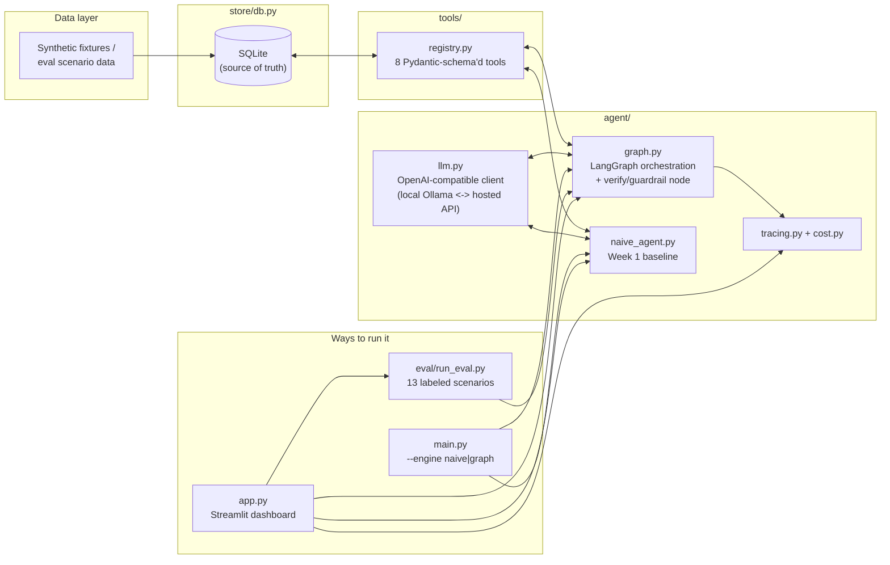
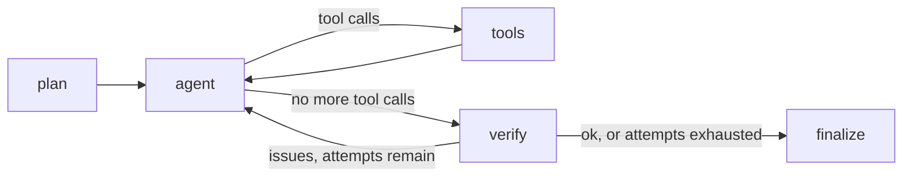

# Daily Ops Copilot

A proactive personal-ops agent that reads a synthetic inbox, calendar, task
list, and notes, and produces a **morning briefing** — without the user
having to prompt-engineer anything. Built as a portfolio project targeting
LLM Application Engineer roles (agentic workflows, reliability, evaluation,
observability), not a toy chatbot demo.

## Why this project

Everyday tools (email, notes, tasks, calendar) aren't AI-native — using them
well still means reading everything yourself and reasoning across scattered
sources of truth. This project simulates that exact problem: an agent that
must **reason over persistent context, plan multi-step actions, call tools
instead of guessing, and never assert a fact it can't verify** against its
own data store. That last point is the whole point — LLMs are probabilistic;
the engineering problem is making their outputs predictable, observable, and
safe anyway.

### System architecture



## Current status: Week 4 — dashboard, diagrams, and a portfolio-ready README

All four planned weeks are now built: a grounded baseline agent, a LangGraph
orchestration with a verify/guardrail node, a systematic eval suite, and
(this week) a Streamlit dashboard plus the architecture diagram above.

**Headline result, still the most important finding in this repo**: the
Week 3 eval suite against the free local model (`llama3.2`) scored **5 PASS
/ 4 SAFE_CAVEAT / 4 FAIL (38% clean pass rate)**. The failures aren't
subtle wording misses — several are the model **wholesale fabricating
calendar events and tasks that don't exist in the ground truth at all**,
and the LLM-judge half of the verify node sometimes misses this even though
it reliably catches narrower single-fact errors. Full details and the
actual generated text are in the
[Week 3 section](#week-3-evaluation-framework) below. This is reported as a
genuine, expected finding about a small free local model's real limits, not
walked back or hidden — that's the entire point of building an eval suite
instead of trusting a single demo run.

### Week 1: grounded baseline agent

What's built:

- **Synthetic dataset** (`data/`) — hand-curated emails, calendar events,
  tasks, and notes, with intentional edge cases: a double-booked pair of
  meetings, an email that states a meeting time contradicting the calendar,
  an ambiguous "let's sync sometime" action item, and a task marked done
  that a stale follow-up email implies is still pending.
- **SQLite store** (`store/db.py`) — the single source of truth. The agent
  is never allowed to answer from memory; every fact must come from a tool
  call against this store.
- **Tool layer** (`tools/`) — 8 Pydantic-schema'd, deterministic, unit-tested
  functions (`get_emails`, `get_calendar_events`, `get_tasks`, `create_task`,
  `update_task_status`, `schedule_event`, `search_notes`, `draft_reply`).
  None of them touch an LLM, which is what makes them independently
  testable (`tests/test_tools.py`, `tests/test_store.py` — 19 tests).
- **OpenAI-compatible LLM client** (`agent/llm.py`) — talks to any
  `/v1/chat/completions` backend. Defaults to a local Ollama model
  (`llama3.2`, free, no API key) purely via a base-URL swap; pointing it at
  OpenAI/Anthropic-compatible hosted APIs is a config change, not a rewrite.
- **Naive tool-calling agent** (`agent/naive_agent.py`) — a plain ReAct-style
  loop with no orchestration graph, no memory, and no verification step yet.
  This is intentional: it's the "before" baseline that the LangGraph +
  guardrail version (Week 2) gets measured against, so the improvement is
  demonstrable rather than asserted.

### A real reliability bug found and fixed in Week 1

Running the naive agent against the local model surfaced a genuine failure
mode, not a hypothetical one: the model frequently emitted the *literal
string* `"null"` for an omitted optional tool argument instead of actually
omitting it. Since the argument's schema is `str | None`, Pydantic happily
accepted `"null"` as a valid string — so `get_tasks(status="null")` silently
filtered on the literal text "null" and returned zero rows, with no error
anywhere. Every tool call "succeeded" and every result was wrong. Fixed in
`tools/registry.py` by normalizing null-sentinel strings (`"null"`, `"none"`,
`""`) to real `None` before validation — with a regression test
(`test_dispatch_normalizes_literal_null_string_to_none`) pinning the
behavior. This is exactly the "probabilistic output → predictable action"
problem the role is about, caught by actually running the system rather than
eyeballing the code.

### Known gaps in the Week-1 baseline (motivated Week 2)

Running `python main.py --engine naive --today 2026-09-10` showed the naive
agent, across different runs:

1. **Hallucinating a meeting time from a stale email over the calendar** —
   reporting the design review at "2:00 PM" (from the fixture email
   `em-004`'s stale claim) instead of the calendar's actual 3:00 PM
   (`ev-001`).
2. **Missing the double-booking** — `ev-001` (3:00-4:00 PM) and `ev-002`
   (3:30-4:00 PM) overlap; the system prompt explicitly says to flag
   overlaps, and every naive run still listed both events with no conflict
   called out.
3. On a different run (same fixtures, same prompt — LLMs are stochastic),
   the time hallucination didn't recur, but a *new* one did: a task marked
   `done` in the store (`tk-002`) was reported as "overdue."

That third point matters as much as the first two: which hallucination
shows up is not consistent run to run, so a single demo run proves very
little either way. That's the real argument for Week 2's structural fix
over further prompt-tweaking, and for Week 3's eval suite over spot-checking
by hand.

## Week 2: LangGraph orchestration + verify/guardrail node

### Architecture



(`agent/graph.py`). `plan` and `agent`/`tools` follow the same message
format and tool-dispatch path as the Week 1 naive agent — LangGraph is used
purely for the state graph, conditional routing, and checkpointing, not to
replace `agent/llm.py` or `tools/registry.py`. One simplification versus the
original 6-node sketch: `act`/`summarize` were dropped as separate nodes
since, for a read-mostly briefing workflow, the draft produced by `agent`
already *is* the summary — a dedicated no-op node would have padded the
graph without adding anything to explain. (Actual write actions — drafting
a reply, creating a task — are deferred to Week 4, paired with the
Streamlit UI's approve/reject button, which is a more honest home for a
human-in-the-loop gate than a CLI `y/n` prompt.)

The **verify** node is two independent checks, deliberately combined:

1. An **LLM fact-checker**, forced via `tool_choice` to call a
   `report_verification(ok, issues)` tool (`tools/verification_schema.py`)
   given the draft plus the actual retrieved tool outputs — it checks
   date/time/status claims and overlap-flagging.
2. A **deterministic check** (`_find_tool_error_issues` in `agent/graph.py`)
   that scans the run's tool-call history for any that actually failed and
   forces `ok=False` if the draft doesn't account for it — regardless of
   what the LLM judge says. Not everything needs an LLM: whether a tool call
   errored is a fact, not a judgment call, and checking it in code is
   strictly more reliable than hoping a judge model notices.

On failure, the graph loops back to `agent` with the issues as feedback (capped at 2 attempts); if still unresolved, it finalizes anyway with a visible `⚠️` caveat rather than looping forever or silently shipping a wrong answer.

### Two more real bugs found by running it (same pattern as Week 1's null-sentinel fix)

- **A stringified array instead of a native one.** The verifier's first live
  test came back with `issues` as the *string* `'["Meeting time discrepancy"]'`
  instead of a JSON array — Pydantic rejects a bare string for `list[str]`
  outright. Fixed once, generally, in `tools/coercion.py` (`StrList`) and
  applied to every `list[str]` tool argument (this field, plus `tags` and
  `attendees` from Week 1, which had the same latent risk untested until now).
- **The mirror-image quirk**: `get_tasks(status=["open"])` — a plain
  `str | None` filter wrapped in a one-element list. Fixed the same way
  (`OptionalStr` in `tools/coercion.py`), applied to every optional string
  filter argument.

Both are pinned with regression tests (`test_dispatch_coerces_json_stringified_list_argument`, `test_dispatch_coerces_single_element_list_to_scalar_string`).

### The guardrail generalized to a failure it wasn't built for

While confirming the fix for the two Week-1 gaps, the LLM also called
`search_notes(query=None)` — a required field, no valid default — which
genuinely failed. The drafting model quietly reported "no results" anyway,
and the LLM verifier's first pass didn't catch it. The **deterministic**
check did, immediately, with no code change: it doesn't care which tool
failed, only that one did. The run correctly finalized with a caveat
instead of a false "verified" claim:

> ⚠️ Automatic fact-check could not fully confirm this briefing after 2
> attempt(s): Design review time conflict: 1:1 with manager overlaps with
> Design review; The search_notes call failed (...) — the draft must not
> present this as 'no data found'; it must say this check could not be
> completed.

Meanwhile the two original Week-1 failures were both actually fixed in that
same run: the design review appeared under "Today's Calendar Events" at the
*correct* 15:00-16:00 (not the email's stale "2pm"), and the overlap with
the 1:1 was identified as an issue on both verify passes (the model never
fully wrote the conflict into the visible draft text within the 2-attempt
budget — which is exactly why the run ended in an honest caveat rather than
a falsely "verified" success). `search_notes`'s `None`-query case is left
unfixed on purpose for now and logged as a Week 3 eval-scenario candidate,
rather than chased down ad hoc — the point of this section is that the
*architecture* catches unanticipated failures, not that every individual
model quirk gets patched reactively.

### Tracing and cost

Every graph run writes a full JSONL trace to `traces/<run_id>.jsonl`
(`agent/tracing.py`) — every LLM call and tool call, with latency, token
usage, and an estimated cost (`agent/cost.py`; $0 for local Ollama, a real
number if `LLM_MODEL` points at a hosted model) — so a run is replayable
after the fact without an external tracing service.

## Week 3: evaluation framework

Single demo runs — even carefully chosen ones like Week 2's — can look
deceptively good while hiding a much lower true reliability rate. Week 3
replaces "does it look right on this one run" with a labeled, repeatable
eval suite.

### Design

- **13 scenarios** (`eval/scenarios/*.json`), each an *isolated, minimal*
  fixture (its own tiny emails/calendar/tasks/notes, seeded via the new
  `Store.seed_from_data`) rather than variations on the one shared `data/`
  dataset — isolating the fixture makes it possible to predict the correct
  output narrowly enough to check deterministically, and makes a failure
  unambiguous to diagnose (only one thing could have caused it). Categories:
  `extraction` (5), `conflict_detection` (3), `hallucination_trap` (3),
  `ambiguous_instruction` (2) — including a negative control
  (`conflict-adjacent-not-overlapping`: two back-to-back but non-overlapping
  events, which must *not* be flagged as a conflict) to catch over-eager
  detection, not just under-detection.
- **Checks** per scenario (`eval/run_eval.py`): `contains_all` /
  `contains_none` / `contains_any_of` (case-insensitive substring checks
  against the final briefing text) plus an optional `expect_verified_ok`.
- **3-way scoring**, not flat pass/fail — this is the part that actually
  matters:
  - **PASS**: content checks passed and `verified_ok` matched expectation.
  - **SAFE_CAVEAT**: the guardrail itself refused to certify the run
    (`verified_ok=False`) instead of confidently asserting something wrong.
    Scored separately from FAIL because honest uncertainty is categorically
    safer than confident wrongness — collapsing the two into one "fail"
    bucket would hide exactly the distinction the whole verify node exists
    to create.
  - **FAIL**: `verified_ok=True` but the content checks failed anyway — a
    confidently wrong answer. The one outcome the architecture is supposed
    to prevent, and therefore the highest-priority signal in the report.
  - `tests/test_eval.py` validates the scenario files themselves (unique
    ids, valid categories, at least one check each) fast and without an LLM,
    so a malformed scenario fails immediately instead of wasting a slow run.

Run it: `python -m eval.run_eval` (or `--scenario <id>` for one). Non-zero
exit code on any FAIL, for wiring into CI-style gating later.

### Real results (llama3.2, 2026-09-07 run)

```
PASS        :   5  (38%)
SAFE_CAVEAT :   4  (31%)
FAIL        :   4  (31%)

by category:
  ambiguous_instruction : 1/2 passed
  conflict_detection    : 1/3 passed
  extraction            : 1/5 passed
  hallucination_trap    : 2/3 passed

total latency: ~400s   total est. cost: $0.00
```

### The real finding: the model sometimes ignores tool results and fabricates data wholesale

This is the headline result, not a footnote. Several FAILs aren't subtle
wording misses — they're the drafting model **inventing calendar events and
tasks that don't exist anywhere in the ground truth**:

- `extraction-empty-inbox` — the dataset is completely empty (no emails,
  events, or tasks). The model's briefing invented *"9:00 AM - Meeting with
  John Doe"* and *"10:30 AM - Team Stand-up"* out of nothing.
- `hallucination-done-task-not-overdue` — the dataset has exactly one task,
  status `done`. The model's briefing ignored it entirely and invented five
  fictional calendar events (today *and* tomorrow) plus two fictional tasks
  with fabricated ids ("Task 1", "Task 2") that appear nowhere in the store.
- `extraction-multiple-tasks-pick-overdue` — correctly listed the three real
  tasks, but *also* invented two fictional meetings and a fictional
  "conflict" between them that isn't in the calendar at all.

**The verify node's LLM-judge half doesn't reliably catch this**, even
though it's the same architecture that correctly caught the Week 2
hallucinations. In the `hallucination-done-task-not-overdue` run, the
verifier said `verified_ok=True` despite the wholesale fabrication above —
it FAILed clean, with no caveat. Compare that to
`conflict-adjacent-not-overlapping`, where the verifier *did* catch a
smaller, more surgical error (a false conflict claim between two adjacent,
non-overlapping events) and correctly drove the run to `SAFE_CAVEAT`. The
pattern across all 13 runs: **the LLM judge is reliable against narrow,
single-fact discrepancies but not against large-scale fabrication** — using
the same small model as both drafter and judge means its blind spots are
partially correlated with each other.

**Interpretation, stated plainly**: `llama3.2` is a small (~3B-class), free,
fully local model. This isn't a bug in the harness, the graph, or the
guardrail design — it's a real, measured capability limit of running a
demanding agentic pipeline on the smallest model that fits the "free,
runs anywhere" constraint. Reporting a 38% clean-pass rate honestly is a
stronger result for this project than a suspiciously perfect one would be:
it's exactly the kind of thing a real eval suite exists to surface before
it reaches production, matching the JD's own framing of the problem
("AI quality improves through systematic evaluation, experimentation, and
iteration").

**Recommendations, not yet implemented** (natural next steps rather than
claims of what was tried): use a stronger model specifically for the
`verify` step, since verification is a much lower-throughput, higher-stakes
call than the main drafting loop and can afford a slower/pricier model even
in an otherwise-free pipeline; consider trimming the retry-feedback message
history, since several failures happened on the second attempt inside a
growing conversation; and treat `llama3.2` as the free/local *fallback*
tier, with a hosted model as the intended default for anything beyond a
portfolio demo.

## Week 4: dashboard

A Streamlit app (`app.py`) that reuses the exact same `store`/`tools`/`agent`/
`eval` code the CLI uses — a viewer and trigger, not a parallel
implementation — with three tabs:

- **Run Briefing** — pick any dataset (the flagship double-booking/stale-email
  fixtures, or any of the 13 isolated eval scenarios), an engine
  (`naive`/`graph`), and a date, then run the real agent live and see the
  briefing, `verified_ok`/attempts, tokens, and estimated cost.
- **Trace Explorer** — loads any `traces/*.jsonl` file (including the one
  just produced) as a timeline table with an expandable raw-JSON view per
  step. Deliberately doesn't force the Week 1 naive agent's simpler trace
  format into this view — Week 1 predates `agent/tracing.py`, and that gap
  is itself part of the Week 1→2 story, not something to paper over.
- **Eval Dashboard** — loads any `eval/results/*.json` file, with an
  outcome-breakdown chart (PASS/SAFE_CAVEAT/FAIL) and a per-category
  pass-rate chart, plus a button to run one scenario live and add it to the
  results. Chart colors are the validated status/categorical palette from
  this project's color-accessibility pass (status colors — good/warning/
  critical — for the 3-way outcome, since that's state, not identity;
  fixed-order categorical hues for the 4 scenario categories), not
  arbitrary defaults.

Run it: `streamlit run app.py`. Verified by directly exercising the
data-loading and Altair chart-construction logic against the real fixtures,
scenarios, trace files, and eval results in this repo (no import or runtime
errors) — full interactive browser verification wasn't available in the
session that built this, so give it a first click-through yourself before
treating it as polished.

## Setup

```bash
python3 -m venv .venv
.venv/bin/pip install -r requirements.txt
python data/generate_fixtures.py     # (re)writes data/*.json
ollama pull llama3.2                 # or point LLM_BASE_URL/LLM_MODEL at a hosted API

python main.py --engine graph --today 2026-09-10 --show-trace   # Week 2 agent (default)
python main.py --engine naive --today 2026-09-10                # Week 1 baseline, for comparison

python -m eval.run_eval                                         # full eval suite (~15-25 min locally)
python -m eval.run_eval --scenario hallucination-stale-email-time  # a single scenario

streamlit run app.py                                             # dashboard: run/trace/eval views
```

Environment variables (all optional, default to local Ollama):

| Variable | Default | Purpose |
|---|---|---|
| `LLM_BASE_URL` | `http://localhost:11434/v1` | Any OpenAI-compatible endpoint |
| `LLM_API_KEY` | `ollama` | Ignored by Ollama; required for hosted APIs |
| `LLM_MODEL` | `llama3.2` | Model name for the configured backend |

Run tests: `.venv/bin/python -m pytest tests/ -v` (38 tests: store, tools,
coercion regressions, graph routing/guardrail logic against a stubbed LLM
client, and eval-scenario schema validation — no live Ollama server
required to run the suite). The eval suite itself (`python -m eval.run_eval`)
does need a live LLM backend and takes ~15-25 minutes locally; it's a
separate, slower step from the fast unit-test suite, not part of it.

## Roadmap

The original 4-week plan is complete: grounded baseline agent, LangGraph
orchestration with a verify/guardrail node, a systematic eval suite, and a
dashboard + architecture diagrams. A demo video/screen-recording was
deliberately scoped out rather than half-done — this README's actual
generated output (Week 2's before/after, Week 3's real eval results) does
that job in text instead.

**Possible next steps**, not committed to a timeline:

- Try a stronger model specifically for the `verify` step (Week 3's own
  recommendation) and re-run the eval suite to see whether the 38% pass
  rate is a `llama3.2` ceiling or something the guardrail architecture can
  close further with a better judge.
- Real Google Calendar/Gmail integration behind the existing `tools/`
  interface, replacing the synthetic fixtures — the tool contracts
  (`tools/schemas.py`) were written generically enough that this shouldn't
  require changing the agent or graph at all, only the tool implementations.
- Human-in-the-loop write actions (drafting a reply, creating a task) gated
  behind an approve/reject step in the dashboard, using LangGraph's
  `interrupt()` — deferred from Week 2 specifically to pair with this UI.
